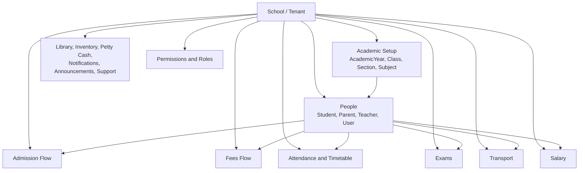
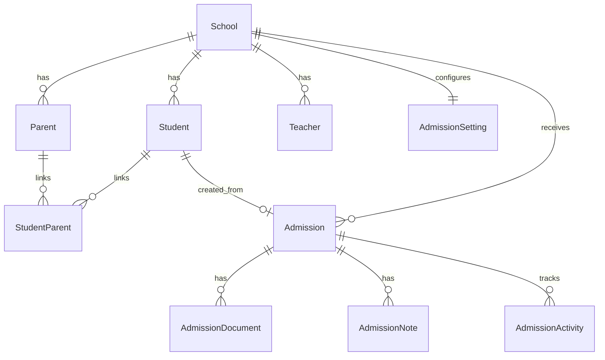
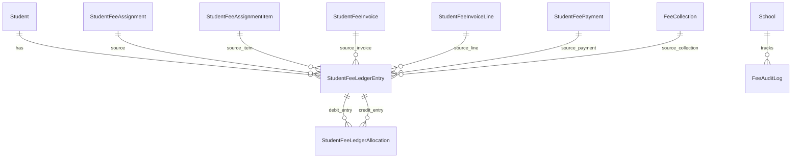
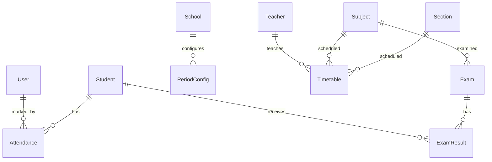
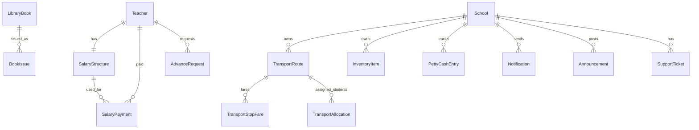
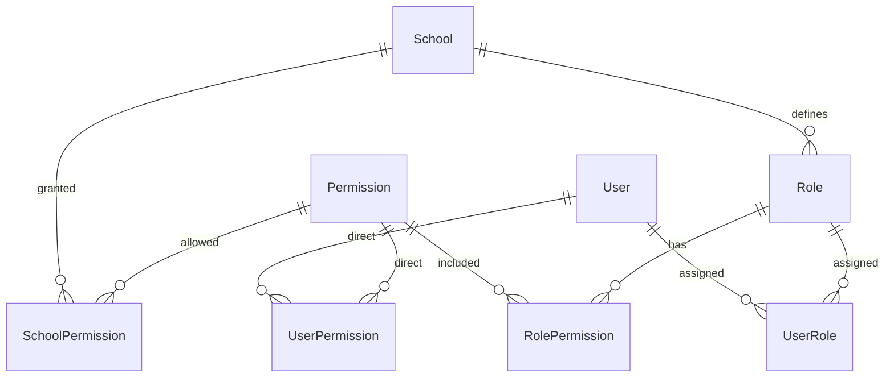
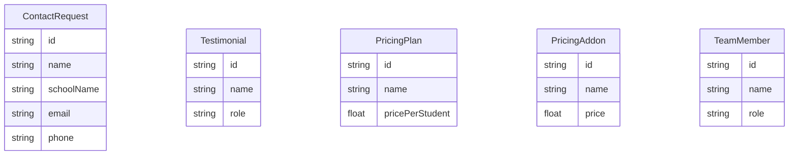
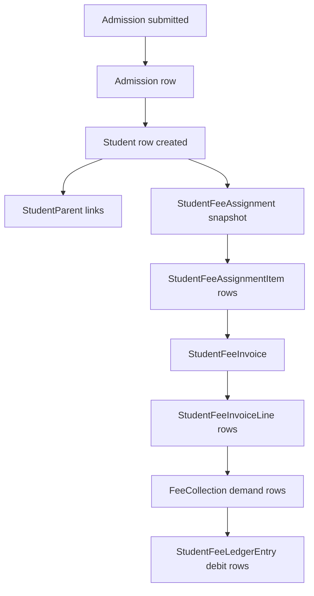
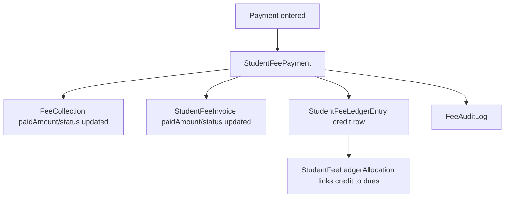
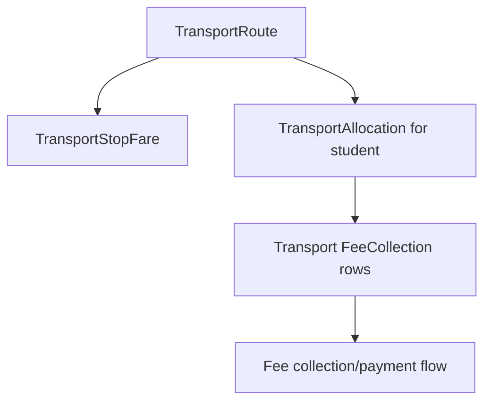

# Database Flow Chart

This document explains the database structure from `prisma/schema.prisma`.

Important rules:

- PostgreSQL is the real database.
- `prisma/schema.prisma` is the single schema file for this project.
- Fields ending with `Id` are usually real foreign-key columns.
- Prisma relation fields such as `school`, `student`, `items`, `payments` are not extra columns; they describe how tables connect.
- Most tenant-owned tables link to `School` through `schoolId`.
- Most operational tables use `createdAt`, `updatedAt`, and often `deletedAt` for soft delete.

## 1. High-Level Flow



## 2. Core Tenant And Academic Tables

```mermaid
erDiagram
  School ||--o{ User : has
  School ||--o{ AcademicYear : has
  School ||--o{ Class : has
  School ||--o{ Section : has
  School ||--o{ Subject : has
  Class ||--o{ Section : contains
  Class ||--o{ ClassSubject : maps
  Subject ||--o{ ClassSubject : maps
  Class ||--o{ Student : has
  Section ||--o{ Student : has
```

Data meaning:

- `School` is the tenant. Nearly every school-owned record stores `schoolId`.
- `School.academicYear` is the current default year. It should be changed only through the guarded academic-year switch flow.
- `Class` is the grade/class, such as Class 1 or Class 10.
- `Section` belongs to a `Class`, such as A or B.
- `Subject` belongs to a school.
- `ClassSubject` links many subjects to many classes.
- `Student` links to `School`, optional `Class`, and optional `Section`.

Current academic year switch rule:

- Create the new `AcademicYear` first.
- Prepare year-wise fees, timetable, transport, admissions, and reports.
- Use Academic Years -> Set Current from the school admin sidebar.
- The UI shows impact counts and requires typing the target year before `School.academicYear` changes.
- Past years should usually be marked inactive, not deleted. Inactive years remain visible for history/report access but are not returned in the normal active-year dropdown list for creating new records.
- History/report screens can request inactive years with `includeInactive=true`, for example View Attendance. New-record screens should keep using only active years.
- Deleting an academic year is also guarded. The UI shows linked record counts and requires typing the year because removing it from active setup can hide linked data from normal filters.
- Deleted academic years can be restored from the Deleted Academic Years section. Restore only clears `deletedAt` and makes the year active again; it does not make the year current.

## 3. People And Admission Flow



Admission storage flow:

1. User fills `Admission`.
2. Documents go into `AdmissionDocument`.
3. Notes go into `AdmissionNote`.
4. Status/history goes into `AdmissionActivity`.
5. When admitted, a `Student` can be created and linked by `Admission.studentId`.
6. Parent records are linked to students through `StudentParent`.

## 4. Fees Flow

```mermaid
erDiagram
  School ||--o{ FeesHead : owns
  School ||--o{ FeesGroup : owns
  FeesGroup ||--o{ FeesGroupItem : includes
  FeesHead ||--o{ FeesGroupItem : included_as
  FeesGroup ||--o{ FeesStructure : uses
  Class ||--o{ FeesStructure : for_class
  Section ||--o{ FeesStructure : optional_section
  FeesStructure ||--o{ FeesStructureItem : has
  FeesHead ||--o{ FeesStructureItem : priced_as

  Student ||--o{ StudentFeeAssignment : assigned
  FeesStructure ||--o{ StudentFeeAssignment : copied_from
  FeesGroup ||--o{ StudentFeeAssignment : group
  StudentFeeAssignment ||--o{ StudentFeeAssignmentItem : snapshot_items
  FeesStructureItem ||--o{ StudentFeeAssignmentItem : copied_from

  StudentFeeAssignment ||--o{ StudentFeeInvoice : creates
  StudentFeeInvoice ||--o{ StudentFeeInvoiceLine : has
  StudentFeeAssignmentItem ||--o{ StudentFeeInvoiceLine : billed_line
  StudentFeeInvoice ||--o{ StudentFeePayment : paid_by
  StudentFeeInvoice ||--o{ FeeCollection : visible_collection_rows
  StudentFeeAssignmentItem ||--o{ FeeCollection : demand_row
```

Fees storage flow:

1. `FeesHead` defines fee type, such as tuition, admission fee, exam fee, transport fee.
2. `FeesGroup` groups heads, such as New Admission or Regular Student.
3. `FeesStructure` is the reusable class/session/group fee template.
4. `FeesStructureItem` stores each amount/installment inside a structure.
5. `StudentFeeAssignment` is a copied snapshot for one student.
6. `StudentFeeAssignmentItem` stores the exact payable rows for that student.
7. `StudentFeeInvoice` and `StudentFeeInvoiceLine` store bill/invoice records.
8. `FeeCollection` keeps compatibility with the collection screen and demand rows.
9. `StudentFeePayment` stores payment records.

## 5. Fees Ledger Flow



Ledger meaning:

- `StudentFeeLedgerEntry` is the accounting-style student fee ledger.
- Debit entries usually mean demand/amount due.
- Credit entries usually mean payment/adjustment.
- `StudentFeeLedgerAllocation` links one credit entry against one debit entry.
- `FeeAuditLog` records fee actions and before/after values as JSON text.

## 6. Attendance, Timetable, Exams



Data meaning:

- `Attendance` stores per-student daily status.
- `Timetable` stores section/subject/teacher/day/period scheduling.
- `PeriodConfig` stores school-level period timings.
- `Exam` stores exam metadata.
- `ExamResult` stores marks for each student in an exam.

## 7. Transport, Salary, Library, Operations



Data meaning:

- `TransportRoute` stores route master data and JSON stops.
- `TransportStopFare` stores route-stop fare by academic year.
- `TransportAllocation` assigns a student to a route/stop.
- `SalaryStructure` stores a teacher's active salary setup.
- `SalaryPayment` stores generated or paid salary records.
- `AdvanceRequest` stores teacher advance requests.
- `LibraryBook` and `BookIssue` handle library inventory.
- `InventoryItem`, `PettyCashEntry`, `Notification`, `Announcement`, and `SupportTicket` are school operations tables.

## 8. Roles And Permissions



Permission meaning:

- `Permission` is the master permission catalog.
- `Role` is school-specific.
- `RolePermission` links roles to permissions.
- `SchoolPermission` controls which permissions a school can use.
- `UserRole` assigns roles to users.
- `UserPermission` gives direct allow/deny overrides to a user.

## 9. Website And SaaS Tables



These tables support the public landing/pricing/contact side. They are not tenant-owned by `School`.

## 10. Table Field Inventory

This section lists fields from `schema.prisma`. Relation fields are included because they show links, but they are not always physical database columns.

### Auth, Tenant, Academic

| Table | Important fields |
|---|---|
| `User` | `id`, `email`, `password`, `name`, `phone`, `avatar`, `dob`, `drivingLicenseNumber`, `mustChangePassword`, `role`, `schoolId`, `isActive`, `lastLoginAt`, `createdAt`, `updatedAt`, `deletedAt`, `school`, `userRoles`, `userPermissions`, `markedAttendance` |
| `School` | `id`, `name`, `logo`, `address`, `city`, `state`, `pincode`, `country`, `contactPhone`, `contactEmail`, `website`, `academicYear`, `board`, `timezone`, `currency`, `subdomain`, `status`, `trialEndsAt`, `onboardingDate`, `favicon`, `primaryColor`, `dashboardFont`, `features`, `createdAt`, `updatedAt`, `deletedAt`, plus relations to all school-owned modules |
| `AcademicYear` | `id`, `schoolId`, `name`, `startDate`, `endDate`, `isCurrent`, `isActive`, `createdAt`, `updatedAt`, `deletedAt`, `school` |
| `Class` | `id`, `schoolId`, `name`, `isActive`, `createdAt`, `updatedAt`, `deletedAt`, `school`, `sections`, `students`, `feesStructures`, `feeAssignments`, `classSubjects` |
| `Section` | `id`, `schoolId`, `classId`, `name`, `teacherId`, `isActive`, `createdAt`, `updatedAt`, `deletedAt`, `school`, `class`, `students`, `timetables`, `feesStructures`, `feeAssignments` |
| `Subject` | `id`, `schoolId`, `name`, `code`, `sequenceNo`, `type`, `isActive`, `createdAt`, `updatedAt`, `deletedAt`, `school`, `timetables`, `exams`, `classSubjects` |
| `ClassSubject` | `id`, `classId`, `subjectId`, `createdAt`, `class`, `subject` |

### People And Admission

| Table | Important fields |
|---|---|
| `Student` | `id`, `schoolId`, `classId`, `sectionId`, `admissionNumber`, `rollNumber`, `firstName`, `lastName`, `dateOfBirth`, `gender`, `nationality`, `religion`, `category`, `motherTongue`, `aadhaarNumber`, `bloodGroup`, `medicalConditions`, `address`, `city`, `state`, `pincode`, `country`, `profileImage`, `admissionDate`, `previousSchool`, `previousSchoolTC`, `previousClass`, `previousResult`, `transferCertNo`, `siblingId`, `admissionStatus`, `isActive`, `createdAt`, `updatedAt`, `deletedAt`, plus relations to parent, attendance, fees, exams, admission |
| `Parent` | `id`, `schoolId`, `userId`, `fatherName`, `motherName`, `phone`, `alternatePhone`, `email`, `occupation`, `address`, `annualIncome`, `isActive`, `createdAt`, `updatedAt`, `deletedAt`, `school`, `children` |
| `Teacher` | `id`, `schoolId`, `userId`, `employeeId`, `firstName`, `lastName`, `dateOfBirth`, `gender`, `address`, `city`, `state`, `pincode`, `aadhaarNumber`, `qualification`, `specialization`, `experience`, `joinDate`, `profileImage`, `isActive`, `createdAt`, `updatedAt`, `deletedAt`, `school`, `timetables`, `salaryStructure`, `salaryPayments`, `advanceRequests` |
| `StudentParent` | `id`, `studentId`, `parentId`, `relation`, `isPrimary`, `createdAt`, `updatedAt`, `student`, `parent` |
| `Admission` | `id`, `schoolId`, `studentId`, `admissionNumber`, `academicYear`, `admissionType`, `status`, personal fields, address fields, parent fields, class/session fields, previous-school fields, transport fields, account/fee fields, workflow fields, `createdAt`, `updatedAt`, `deletedAt`, `school`, `student`, `documents`, `notes`, `activities` |
| `AdmissionDocument` | `id`, `admissionId`, `documentType`, `documentName`, `fileUrl`, `fileSize`, `fileType`, `uploadedAt`, `verificationStatus`, `verifiedBy`, `verifiedAt`, `rejectionReason`, `isRequired`, `createdAt`, `updatedAt`, `admission` |
| `AdmissionNote` | `id`, `admissionId`, `note`, `noteType`, `createdBy`, `createdAt`, `updatedAt`, `admission` |
| `AdmissionActivity` | `id`, `admissionId`, `action`, `fromValue`, `toValue`, `performedBy`, `description`, `createdAt`, `admission` |
| `AdmissionSetting` | `id`, `schoolId`, `admissionNumberPrefix`, `admissionNumberFormat`, `sequenceStart`, `sequenceDigits`, `resetSequenceYearly`, `academicYear`, `admissionOpenDate`, `admissionCloseDate`, `minAge`, `maxAge`, `ageCalculationDate`, `requiredDocuments`, `customFields`, `allowOnlineSubmission`, `requirePhoto`, `requireAadhaar`, `maxApplicationsPerClass`, `enableWaitlist`, `autoVerifyDocuments`, `admissionFeeRequired`, `formFeeAmount`, `notificationEmails`, `printTemplate`, `isActive`, `createdAt`, `updatedAt`, `school` |

### Fees

| Table | Important fields |
|---|---|
| `FeesHead` | `id`, `schoolId`, `name`, `frequency`, `headType`, `isOptional`, `applicability`, `isActive`, `createdAt`, `updatedAt`, `deletedAt`, `school`, `groupItems`, `structureItems`, `assignmentItems` |
| `FeesGroup` | `id`, `schoolId`, `name`, `description`, `isActive`, `createdAt`, `updatedAt`, `deletedAt`, `school`, `items`, `structures`, `assignments` |
| `FeesGroupItem` | `id`, `groupId`, `feeHeadId`, `createdAt`, `updatedAt`, `group`, `feeHead` |
| `FeesStructure` | `id`, `schoolId`, `feesGroupId`, `classId`, `sectionId`, `academicYear`, `name`, `version`, `status`, `effectiveFrom`, `effectiveTo`, `lockedAt`, `lockedBy`, `isActive`, `createdAt`, `updatedAt`, `deletedAt`, `school`, `feesGroup`, `class`, `section`, `items`, `assignments` |
| `FeesStructureItem` | `id`, `feeStructureId`, `feeHeadId`, `installmentName`, `amount`, `dueDate`, `lateFee`, `frequency`, `createdAt`, `updatedAt`, `feeStructure`, `feeHead`, `assignmentItems` |
| `StudentFeeAssignment` | `id`, `schoolId`, `studentId`, `feeStructureId`, `feesGroupId`, `classId`, `sectionId`, `academicYear`, `name`, `source`, `status`, `effectiveFrom`, `effectiveTo`, `assignedBy`, `assignedAt`, `snapshotJson`, `createdAt`, `updatedAt`, `deletedAt`, `school`, `student`, `feeStructure`, `feesGroup`, `class`, `section`, `items`, `invoices`, `ledgerEntries` |
| `StudentFeeAssignmentItem` | `id`, `assignmentId`, `feeStructureItemId`, `feeHeadId`, `feeHeadName`, `billingBehavior`, `installmentName`, `amount`, `dueDate`, `lateFee`, `headType`, `isOptional`, `status`, `createdAt`, `updatedAt`, `assignment`, `feeStructureItem`, `feeHead`, `invoiceLines`, `feeCollections`, `ledgerEntries` |
| `StudentFeeInvoice` | `id`, `schoolId`, `studentId`, `assignmentId`, `invoiceNumber`, `invoiceDate`, `dueDate`, `subtotal`, `discount`, `concession`, `scholarship`, `fine`, `totalAmount`, `paidAmount`, `status`, `lockedAt`, `lockedBy`, `notes`, `createdAt`, `updatedAt`, `deletedAt`, `school`, `student`, `assignment`, `lines`, `payments`, `collections`, `ledgerEntries` |
| `StudentFeeInvoiceLine` | `id`, `invoiceId`, `assignmentItemId`, `feeHeadName`, `installmentName`, `amount`, `discount`, `concession`, `scholarship`, `fine`, `totalAmount`, `dueDate`, `status`, `createdAt`, `updatedAt`, `invoice`, `assignmentItem`, `ledgerEntries` |
| `FeeCollection` | `id`, `schoolId`, `studentId`, `feeStructureItemId`, `studentFeeAssignmentItemId`, `studentFeeInvoiceId`, `amount`, `paidAmount`, `discount`, `concession`, `scholarship`, `fine`, `paymentStatus`, `paymentMethod`, `transactionRef`, `paymentDate`, `receiptNumber`, `dueDate`, `installmentName`, `feeHeadName`, `notes`, `createdAt`, `updatedAt`, `deletedAt`, `school`, `student`, `assignmentItem`, `invoice`, `ledgerEntries` |
| `StudentFeePayment` | `id`, `schoolId`, `studentId`, `invoiceId`, `amount`, `paymentMethod`, `transactionRef`, `receiptNumber`, `paymentDate`, `notes`, `receivedBy`, `createdAt`, `updatedAt`, `school`, `student`, `invoice`, `ledgerEntries` |
| `StudentFeeLedgerEntry` | `id`, `schoolId`, `studentId`, `academicYear`, `assignmentId`, `assignmentItemId`, `invoiceId`, `invoiceLineId`, `paymentId`, `feeCollectionId`, `entryType`, `sourceType`, `sourceId`, `feeHeadName`, `installmentName`, `description`, `debit`, `credit`, `balanceAmount`, `dueDate`, `transactionDate`, `paymentMethod`, `transactionRef`, `receiptNumber`, `status`, `notes`, `createdBy`, `createdAt`, `updatedAt`, `deletedAt`, relations to all source records and allocations |
| `StudentFeeLedgerAllocation` | `id`, `schoolId`, `studentId`, `debitEntryId`, `creditEntryId`, `amount`, `allocatedAt`, `receiptNumber`, `notes`, `createdAt`, `updatedAt`, `deletedAt`, `school`, `student`, `debitEntry`, `creditEntry` |
| `FeeAuditLog` | `id`, `schoolId`, `entityType`, `entityId`, `action`, `oldValue`, `newValue`, `changedBy`, `createdAt`, `school` |

### Attendance, Timetable, Exams

| Table | Important fields |
|---|---|
| `Attendance` | `id`, `schoolId`, `studentId`, `academicYear`, `date`, `status`, `remarks`, `markedBy`, `finalized`, `finalizedAt`, `finalizedBy`, `createdAt`, `updatedAt`, `school`, `student`, `markedByUser` |
| `Timetable` | `id`, `schoolId`, `academicYear`, `classId`, `sectionId`, `subjectId`, `teacherId`, `day`, `period`, `startTime`, `endTime`, `roomNo`, `createdAt`, `updatedAt`, `deletedAt`, `school`, `section`, `subject`, `teacher` |
| `PeriodConfig` | `id`, `schoolId`, `period`, `startTime`, `endTime`, `label`, `isBreak`, `createdAt`, `updatedAt`, `school` |
| `Exam` | `id`, `schoolId`, `name`, `subjectId`, `classId`, `sectionId`, `examDate`, `totalMarks`, `passingMarks`, `duration`, `academicYear`, `createdAt`, `updatedAt`, `deletedAt`, `school`, `subject`, `results` |
| `ExamResult` | `id`, `schoolId`, `examId`, `studentId`, `marksObtained`, `grade`, `remarks`, `createdAt`, `updatedAt`, `school`, `exam`, `student` |

### Salary, Transport, Operations

| Table | Important fields |
|---|---|
| `SalaryStructure` | `id`, `schoolId`, `teacherId`, `basicSalary`, `hra`, `da`, `ta`, `medicalAllowance`, `specialAllowance`, `pf`, `esi`, `tax`, `otherDeductions`, `grossSalary`, `netSalary`, `effectiveFrom`, `isActive`, `createdAt`, `updatedAt`, `school`, `teacher`, `payments` |
| `SalaryPayment` | `id`, `schoolId`, `teacherId`, `salaryStructureId`, `month`, `year`, salary component fields, deduction fields, `totalDeductions`, `netPayable`, `paymentStatus`, `paymentDate`, `paymentMethod`, `transactionRef`, `generatedOn`, `createdAt`, `updatedAt`, `school`, `teacher`, `salaryStructure` |
| `AdvanceRequest` | `id`, `schoolId`, `teacherId`, `amount`, `reason`, `requestDate`, `approvalStatus`, `approvedBy`, `approvedAt`, `deductionMonth`, `deductionYear`, `createdAt`, `updatedAt`, `school`, `teacher` |
| `TransportRoute` | `id`, `schoolId`, `routeName`, `routeNumber`, `academicYear`, `feeMonths`, `startPoint`, `endPoint`, `stops`, `distance`, `driverName`, `driverPhone`, `vehicleNumber`, `fee`, `isActive`, `createdAt`, `updatedAt`, `deletedAt`, `school`, `allocations`, `stopFares` |
| `TransportStopFare` | `id`, `schoolId`, `routeId`, `academicYear`, `stopName`, `fare`, `feeMonths`, `isActive`, `createdAt`, `updatedAt`, `route` |
| `TransportAllocation` | `id`, `schoolId`, `studentId`, `routeId`, `academicYear`, `pickupPoint`, `dropPoint`, `stopName`, `fareAmount`, `feeMonths`, `isActive`, `createdAt`, `updatedAt`, `route` |
| `LibraryBook` | `id`, `schoolId`, `title`, `author`, `isbn`, `publisher`, `category`, `edition`, `quantity`, `available`, `shelfNumber`, `price`, `isActive`, `createdAt`, `updatedAt`, `deletedAt`, `school`, `issues` |
| `BookIssue` | `id`, `schoolId`, `bookId`, `studentId`, `teacherId`, `issueDate`, `dueDate`, `returnDate`, `fine`, `status`, `createdAt`, `updatedAt`, `school`, `book` |
| `InventoryItem` | `id`, `schoolId`, `name`, `category`, `quantity`, `unit`, `unitPrice`, `totalPrice`, `supplier`, `purchaseDate`, `condition`, `location`, `isActive`, `createdAt`, `updatedAt`, `deletedAt`, `school` |
| `PettyCashEntry` | `id`, `schoolId`, `amount`, `type`, `category`, `description`, `createdBy`, `approvedBy`, `approvalStatus`, `date`, `createdAt`, `updatedAt`, `school` |
| `Notification` | `id`, `schoolId`, `userId`, `title`, `message`, `type`, `isRead`, `createdAt`, `updatedAt`, `school` |
| `Announcement` | `id`, `schoolId`, `title`, `content`, `audience`, `priority`, `isActive`, `createdAt`, `updatedAt`, `deletedAt`, `school` |
| `SupportTicket` | `id`, `schoolId`, `userId`, `subject`, `description`, `category`, `priority`, `status`, `assignedTo`, `resolution`, `createdAt`, `updatedAt`, `school` |

### RBAC And Public Website

| Table | Important fields |
|---|---|
| `Permission` | `id`, `code`, `name`, `module`, `description`, `action`, `isActive`, `createdAt`, `updatedAt`, `rolePermissions`, `schoolPermissions`, `userPermissions` |
| `Role` | `id`, `schoolId`, `name`, `description`, `color`, `isSystem`, `isActive`, `createdAt`, `updatedAt`, `deletedAt`, `school`, `permissions`, `userRoles` |
| `RolePermission` | `id`, `roleId`, `permissionId`, `createdAt`, `role`, `permission` |
| `SchoolPermission` | `id`, `schoolId`, `permissionId`, `grantedBy`, `grantedAt`, `school`, `permission` |
| `UserPermission` | `id`, `userId`, `permissionId`, `granted`, `grantedBy`, `createdAt`, `user`, `permission` |
| `UserRole` | `id`, `userId`, `roleId`, `assignedBy`, `createdAt`, `user`, `role` |
| `ContactRequest` | `id`, `name`, `schoolName`, `email`, `phone`, `studentCount`, `message`, `addOns`, `status`, `notes`, `contactedBy`, `contactedAt`, `createdAt`, `updatedAt` |
| `Testimonial` | `id`, `name`, `role`, `quote`, `stars`, `avatarUrl`, `isActive`, `sortOrder`, `createdAt`, `updatedAt`, `deletedAt` |
| `PricingPlan` | `id`, `name`, `pricePerStudent`, `billingCycle`, `description`, `features`, `highlights`, `isActive`, `isPopular`, `sortOrder`, `createdAt`, `updatedAt`, `deletedAt` |
| `PricingAddon` | `id`, `name`, `description`, `icon`, `price`, `priceLabel`, `type`, `isActive`, `sortOrder`, `createdAt`, `updatedAt`, `deletedAt` |
| `TeamMember` | `id`, `name`, `role`, `bio`, `image`, `phone`, `email`, `linkedin`, `twitter`, `github`, `instagram`, `facebook`, `website`, `isActive`, `sortOrder`, `createdAt`, `updatedAt`, `deletedAt` |

## 11. Practical Data Flow Examples

### New student admission with fees



### Fee payment



### Transport fee source


